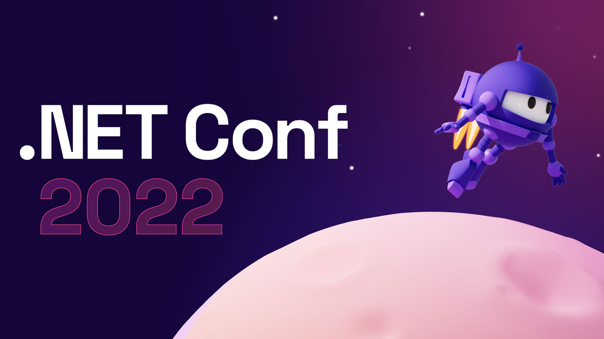

# .NET Conf Recap - Windows
Presentation for the [Dot Net North](https://www.meetup.com/DotNetNorth) 'Microsoft Ignite After Party / .NET Conf Recap' event in November 2022. An overview of what's new for Windows Developers in .NET 7 .[Meetup listing](https://www.meetup.com/dotnetnorth/events/288475312/).

[Presentation Link](https://github.com/mikeirvingweb/dotnetconf22-windows/raw/main/presentation/2022-11-22-Mike-Irving-Windows.pptx)

**Windows Apps**

.NET 7 for all apps

- **Modernising Apps**
  - The Windows Apps SDK
  - .NET Upgrade Assistant 
- **Blazor Hybrid Apps**
- **WinUI 3**
- **Uno Platform**
- **Avalonia UI**

---

**Links from presentation**

**The Windows Apps SDK**  
📄 [Microsoft Learn](https://learn.microsoft.com/en-us/windows/apps/windows-app-sdk/)  
🧑‍💻 [GitHub](https://github.com/microsoft/WindowsAppSDK)  

**.NET Upgrade Assistant**   
⚙️ [.NET Upgrade Assistant](https://aka.ms/dotnet/upgrade)  

**Blazor Hybrid Apps**  
📄 [Microsoft Learn](https://learn.microsoft.com/en-us/aspnet/core/blazor/hybrid/)  
🌍 [Blazor website](https://dotnet.microsoft.com/en-us/apps/aspnet/web-apps/blazor)  
🧑‍💻 [GitHub](https://github.com/dotnet/aspnetcore)  
📽️ [Create native desktop & mobile apps using web skills in Blazor HybridEilon Lipton & James Montemagno](https://youtube.com/watch?v=ojcvL8KCOwo)  

**WinUI 3**  
📄 [Microsoft Learn](https://learn.microsoft.com/en-us/windows/apps/winui/winui3/)  
🖼️ [WinUI 3 Gallery](https://apps.microsoft.com/store/detail/winui-3-gallery/9P3JFPWWDZRC)  
🧑‍💻 [Windows Community Toolkit](https://aka.ms/toolkit/windows)  
🧑‍💻 [GitHub](https://github.com/microsoft/microsoft-ui-xaml)  
📽️ [Building Windows apps with WinUI 3 and .NET – Nick Randolph](https://youtube.com/watch?v=sYBCFTRmHOA)  
📽️ [Accelerate your WinUI 3 app with the Windows Community Toolkit – Michael A. Hawker 🪅](https://youtube.com/watch?v=WH-vRxvY95M)  

**Uno Platform**  
🌍 [Uno Platform](https://platform.uno/)  
🖼️ [Uno Platform Gallery](https://gallery.platform.uno/)  
🛝 [Uno Platform Playground](https://playground.platform.uno/)  
🎨 [Uno Platform for Figma](https://platform.uno/unofigma/)  
🧑‍💻 [GitHub](https://github.com/unoplatform)  
📽️ [Building Windows apps with WinUI 3 and .NET – Nick Randolph](https://youtube.com/watch?v=sYBCFTRmHOA)  

**Avalonia UI**  
🌍 [Avalonia UI](https://avaloniaui.net/)  
🛝 [Avalonia UI Playground](https://play.avaloniaui.net/)  
🧑‍💻 [GitHub](https://github.com/AvaloniaUI/Avalonia)  
📽️ [OSS Spotlight - Build amazing cross-platform UI for .NET with Avalonia UI! – Mike James](https://youtube.com/watch?v=qcZSr2ejH5I)  

---
For more info, find / contact me at:  
[Twitter](https://twitter.com/mikeirvingweb) • [LinkedIn](https://www.linkedin.com/in/mikeirving) • [GitHub](https://github.com/mikeirvingweb) • [Stack Overflow](https://stackoverflow.com/users/482901/mike-irving) • [Website & Blog](https://www.mike-irving.co.uk/)
